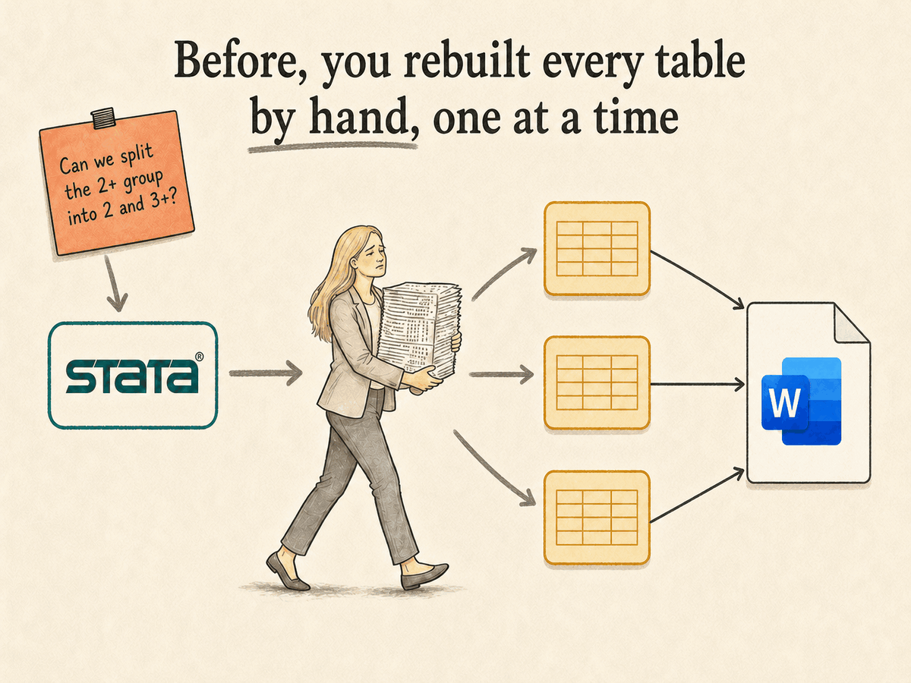
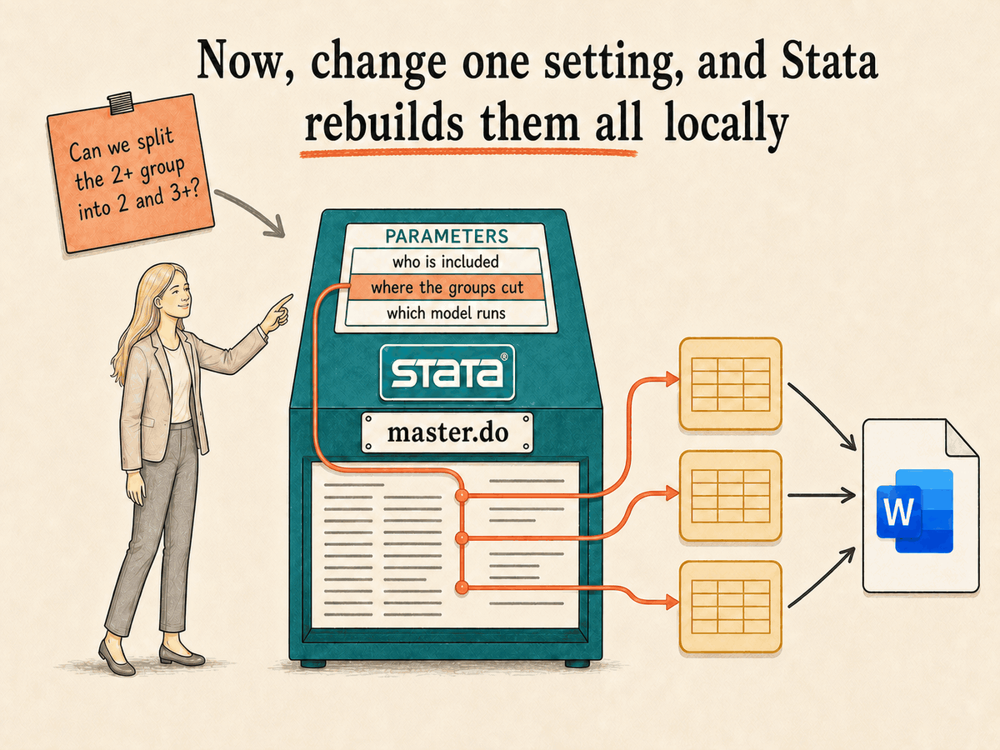
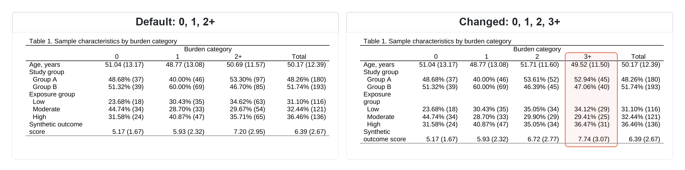

# Reproducible Stata Word Tables

[](https://www.stata.com/stata18/)
[](LICENSE)

## One change shouldn't mean rebuilding every table by hand

You know the request: "Can you make one small change?" Maybe a moved cutoff, a different exclusion, or one more covariate. The rerun takes minutes. Rebuilding every affected Word table is what eats the afternoon, and every manual edit is another chance for error.

This project moves the table work into one do-file. Change the input once and rerun, and Stata rebuilds every affected table in one Word document, along with a complete log and a short verification receipt. It's a transparent starter project, not a new command. Read it, run it, and adapt it to your manuscript.

| Before | After |
|---|---|
|  |  |

## See it work

The demo changes one parameter, `category_cut`, from 2 to 3. Table 1 gains a category, and both model tables update their terms in the same run.

[](docs/images/category-cut-comparison.png)

These screenshots come from the Word files in `example-output/`.

## What the demo creates

Running `do/master.do` rebuilds:

- `data/synthetic_study.dta`, a repeatable dataset with 400 simulated records.
- `output/stata_word_tables.docx`, with one descriptive table and two regression tables.
- `logs/stata_word_tables_run.log` and `logs/synthetic_data.log`, with the complete Stata commands and results.
- `logs/verification_receipt.txt`, with the active settings, sample size, and assertion status.

All values are synthetic.

## Requirements

- Stata 18 or newer. The table machinery is built-in `dtable`, `etable`, `collect`, and `putdocx`, with no community-contributed packages.
- Everything runs locally, and nothing needs an internet connection.

## Run the demo

1. Download or clone this repository.
2. Start Stata in the repository folder.
3. Run:

```stata
do "do/master.do"
```

If Stata starts somewhere else, you need two edits. Put the repository's full path in `project_dir` inside `do/master.do`, and run the file by its full path as well, for example `do "C:/projects/reproducible-stata-word-tables/do/master.do"`. The full path in the run command lets Stata find the file, and `project_dir` sends the outputs to the repository.

Before you run it in a live session, know that the file starts with `clear all`, closes any log you have open, and leaves the working directory set to the repository folder.

When the run finishes, open `output/stata_word_tables.docx`. The Results window should end with `REPORT BUILD COMPLETE.`

## Try one change

Open `do/master.do` and, in the parameter block, change:

```stata
local category_cut      2
```

to:

```stata
local category_cut      3
```

Rerun the file. This is the exact edit behind the comparison above. The new category appears across all three tables, and the rerun replaces the Word document, log, and receipt with the new results.

## Adapt it to your work

Routine choices belong in the parameter block: cutoffs, exclusions, outcomes, covariates, clustering variables. Requests that change the output structure itself, like a new table or a different model family, need a code change.

The [extension guide](docs/extension-guide.md) explains how to make those changes safely, including prompt patterns for handing the work to an AI assistant. The assistant revises the do-file against synthetic data; you still choose the analysis, review the code, and run it locally.

## How it relates to other Stata table tools

This project doesn't replace `estout`/`esttab`, `outreg2`, `asdoc`, or Stata's own reporting commands. Those tools create and export individual tables. This project coordinates a related set of tables from one parameter block and produces the Word document, log, and receipt together.

R and Quarto already treat parameterized reporting as a native workflow. This project is for researchers who analyze in Stata and write in Word.

## Origins and privacy

This project came out of my AI coaching work. I help individuals and organizations put AI to work in their daily routines, and one of my clients is a medical statistician at a state university. Working alongside her, I noticed she was living the exact problem this README opens with, and I was sure there was a better way. Gathering detailed context from our sessions, I worked with Claude Code to build a solution. What started as a fix for her workflow turned out to be a pattern other Stata researchers can adapt.

This public version keeps the general workflow and removes the private research context. It contains synthetic data only, with no private code, research variables, unpublished methods, or implied endorsement. I also squashed the earlier development history into a single initial commit for the same reason.

## Limits

- The demo covers one descriptive table and two linear regression tables. It isn't a universal manuscript generator.
- A clean run confirms the code executed as written, not that the design or model choices are sound.
- The output is tables only. Numbers typed into manuscript prose can still go stale.
- Formatting follows a generic style; check it against your target journal.

## Citation, contributions, and license

Use the repository's `CITATION.cff` metadata if you cite the project.

If the demo breaks, open an issue. [CONTRIBUTING.md](CONTRIBUTING.md) explains what to include and what this project does and doesn't take on.

This project uses the [MIT License](LICENSE).

Stata is a registered trademark of StataCorp LLC, and Microsoft Word is a trademark of Microsoft Corporation. This project is affiliated with neither.
